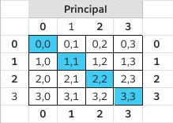
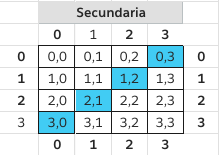

# Alg12020Mtrix - Matriz Grafica

Realizar los métodos acompañados de la interfaz gráfica vista en clases que den solución a la siguiente problemática.

    plus: prinpical.

       

    1. Dada una matriz de n x n retorne una matriz donde solo muestre los elementos de la diagonal secundaria.
        

    2. Dada una matrix de n x n retorne una matriz donde solo muestre los elementos de la triangular superior.

    3. Dada una matrix de n x n retorne una matriz donde solo muestre los elementos de la triangular inferior.
    
    4. Dada una matrix de n x m retorne una matriz donde muestre la matriz traspuesta a la ingresada.
    
    5. Dada una matriz de n x m retorne una matriz con los elementos que conforman la letra A.
    
    6. Dada una matriz de n x m retorne una matriz con los elementos que conforman la letra Z.
    
    7. Dada una matriz de n x m retorne una matriz con los elementos que conforman la letra T.
    
    8. Dada una matriz de n x m retorne una matriz con los elementos que conforman la letra V.
    
    9. Dada una matriz de n x m retorne una matriz con los elementos que conforman la letra E.

    10. Dada una matriz de n x m retorne una matriz con los elementos que conforman la letra F.
    
    11. Dada una matriz de n x m retorne una matriz con los elementos que conforman la letra P.
    
    12. Dada una matriz de n x m retorne una matriz con los elementos que conforman la letra I.
    
    13. Dada una matriz de n x m retorne una matriz con los elementos que conforman la letra N.
    
    14. Dada una matriz de n x m retorne una matriz con los elementos que conforman la letra Y.
    
    15. Dada una matriz de n x m retorne una matriz con los elementos que conforman la letra X.
    ---
